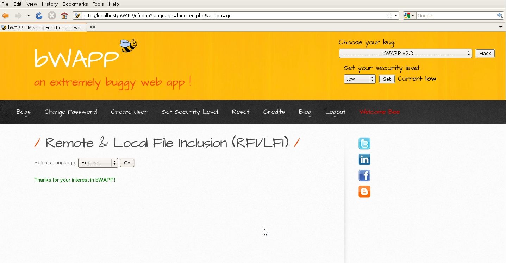

# `02` Identificación de la vulnerabilidad

- En la página de LFI, verás una URL que incluye un parámetro para seleccionar un archivo, por ejemplo:

```bash
http://<tu_ip>/bWAPP/rlfi.php?language=lan_en.php&action=go
```



> 💡Observa que el parámetro language probablemente está siendo usado para incluir un archivo de idioma en la página.
