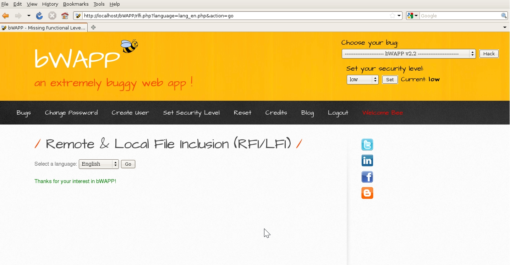

# `02` Vulnerability Identification

- On the LFI page, you will see a URL that includes a parameter for selecting a file, for example:

    ```bash
    http://<your_ip>/bWAPP/rlfi.php?language=lan_en.php&action=go
    ```



> 💡 Note that the `language` parameter is likely being used to include a language file on the page.