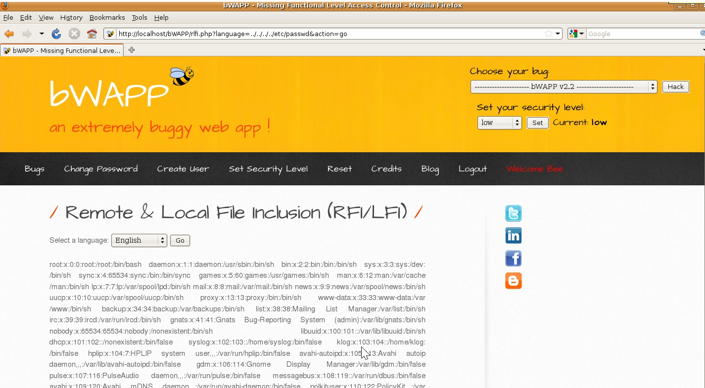

# `03` Exploiting the LFI Vulnerability

When performing a Local File Inclusion (LFI) attack, the goal is to include files that are stored on the server (where the page you want to attack is hosted). In this case, we will try to access the `/etc/passwd` file, which is a common file on Linux servers that contains information about system users.

- Modify the `language` parameter to attempt including a system file. For example:

    ```bash
    http://<your_ip>/bWAPP/rlfi.php?language=../../../../etc/passwd&action=go
    ```

By modifying the `language` parameter, you are trying to include a file from the server where bWAPP is running. When you place `../../../../etc/passwd` in the URL, the browser sends that request to the server, and if the LFI vulnerability exists, the server includes the contents of the `/etc/passwd` file and displays it on the web page.

